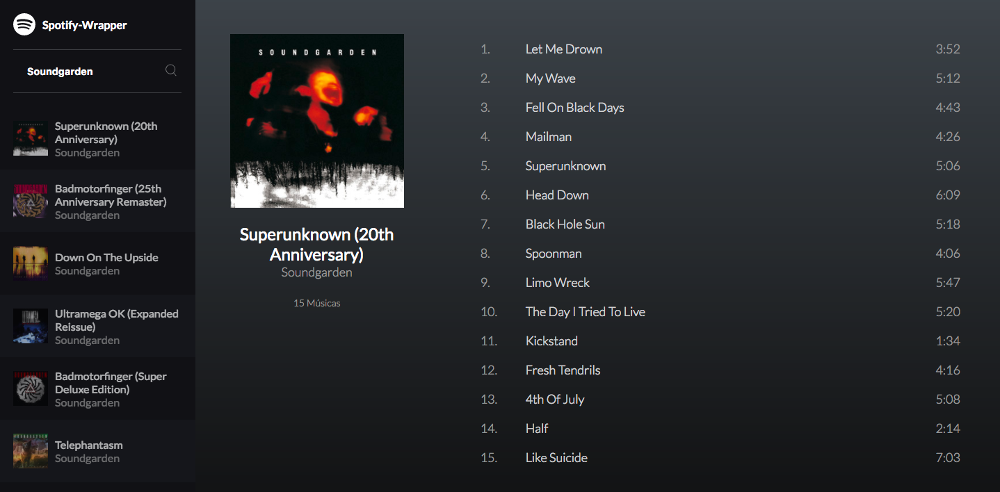

# Spotify Wrapper Player

> This application uses [spotify-wrapper](https://github.com/willianjusten/spotify-wrapper) library to get informations and songs from Spotify. It was created on my [JS TDD course](https://willianjusten.com.br/cursos/) just for study purposes.

## Browser Support

This Application relies on [Fetch API](https://fetch.spec.whatwg.org/). And this API is supported in the following browsers.

 |  |  |  |  |
--- | --- | --- | --- | --- |
39+ ✔ | 42+ ✔ | 29+ ✔ | 10.1+ ✔ | Nope ✘ |

## How to Run

1. First go to [Spotify Developers API](https://developer.spotify.com/web-api/) and create your Token. Then add your token on [src/Spotify.js](src/Spotify.js). **Remember that the token will expire in 60min**
2. Install the dependencies with `npm i`.
3. Run your application with `npm start`.

## Something in the future?

- [ ] Create authentication method to get Token
- [ ] Show similar artists
- [ ] Create player buttons (prev, pause/play, pause)
- [ ] Show music timeline
- [ ] Be creative =D

## Contributing

Please read [CONTRIBUTING.md](CONTRIBUTING.md) for details on our code of conduct, and the process for submitting pull requests to us.

## Versioning

We use [SemVer](http://semver.org/) for versioning. For the versions available, see the [tags on this repository](https://github.com/willianjusten/spotify-wrapper-player/tags).

## Authors

| |
|:---------------------:|
|  [Willian Justen](https://github.com/willianjusten/)   |

See also the list of [contributors](https://github.com/willianjusten/spotify-wrapper-player/contributors) who participated in this project.

## License

This project is licensed under the MIT License - see the [LICENSE.md](LICENSE.md) file for details

